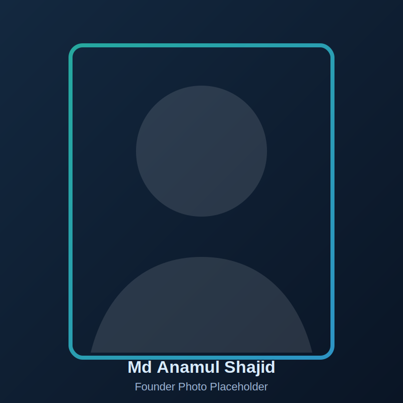

# Adnoryx Digital Website

Professional, mobile-first, high-converting static website for **Adnoryx Digital**.

## Stack
- HTML5
- CSS3
- Vanilla JavaScript
- No backend required (GitHub Pages ready)

## Project Structure
```text
adnoryx-digital/
  assets/
    favicon.svg
    founder-placeholder.svg
    og-image.svg
  index.html
  styles.css
  script.js
  robots.txt
  sitemap.xml
  site.webmanifest
  README.md
```

## 1) Run Locally (Beginner Friendly)
1. Open terminal in VS Code.
2. Run:
   ```powershell
   cd d:\AdNoryxDigital\adnoryx-digital
   py -m http.server 5500
   ```
3. Open browser: `http://localhost:5500`
4. Stop local server anytime with `Ctrl + C`.

## 2) Edit Text, Images, and Links
### Main content
- File: `index.html`
- Update business text section-by-section using IDs:
  - Hero: `#home`
  - Services: `#services`
  - Process: `#process`
  - Case studies: `#case-studies`
  - Pricing: `#pricing`
  - About: `#about`
  - FAQ: `#faq`
  - Contact: `#contact`

### Founder photo
- Replace: `assets/founder-placeholder.svg`
- Or update this line in `index.html` to your new image path:
  ```html
  
  ```

### Branding (colors/fonts)
- File: `styles.css`
- Update CSS variables in `:root`:
  - `--bg`, `--bg-soft` (dark base)
  - `--accent`, `--accent-2` (brand accents)
- Fonts used:
  - Headings: `Space Grotesk`
  - Body: `Manrope`

### CTA links
- Update WhatsApp links in `index.html`:
  - Find: `https://wa.me/8801680861295`
- Update email:
  - Find: `mdanamulshajid@gmail.com`

## 3) Connect Contact Form (Formspree)
1. Create free account at https://formspree.io
2. Create a new form and copy your form endpoint.
3. Open `index.html`, find:
   ```html
   action="https://formspree.io/f/your-form-id"
   ```
4. Replace `your-form-id` with your actual ID.
5. Commit and push changes.

## 4) Add Analytics (Meta Pixel + Google Analytics)
- In `index.html`, analytics placeholders are already added as comments in `<head>`.
- Search for:
  - `Meta Pixel placeholder`
  - `Google Analytics placeholder`
- Uncomment blocks and replace IDs.

## 5) Basic SEO Setup (Important)
Before going live, update these values in `index.html`:
- `canonical` URL
- `og:url`
- `og:image`
- Twitter image URL

Also update:
- `sitemap.xml` -> `<loc>` URL
- `robots.txt` -> sitemap URL
- `site.webmanifest` -> `start_url` if repo name/path changes

## 6) Deploy to GitHub Pages (Exact Steps)
### A. Push this website to a GitHub repo
Run these commands from `d:\AdNoryxDigital\adnoryx-digital`:
```powershell
cd d:\AdNoryxDigital\adnoryx-digital
git init
git add .
git commit -m "Initial Adnoryx Digital website"
git branch -M main
git remote add origin https://github.com/<your-username>/adnoryx-digital.git
git push -u origin main
```

### B. Enable GitHub Pages
1. Open your GitHub repo.
2. Go to `Settings` -> `Pages`.
3. Under `Build and deployment`:
   - Source: `Deploy from a branch`
   - Branch: `main`
   - Folder: `/(root)`
4. Click `Save`.
5. Wait 1-3 minutes.

Your live URL will be:
`https://<your-username>.github.io/adnoryx-digital/`

## 7) After Deployment Checklist
- Test on mobile and desktop.
- Test all CTA buttons.
- Submit test form.
- Replace placeholder testimonials/case studies with real proof.
- Replace social profile links with your real pages.

## Brand Kit Placeholder
- Agency: **Adnoryx Digital**
- Founder: **Md Anamul Shajid**
- Color direction:
  - Deep Navy: `#07121f`
  - Slate Blue: `#0d1f34`
  - Teal Accent: `#2dd4bf`
  - Sky Accent: `#38bdf8`
- Tone: confident, clear, practical, professional.

## Notes
- Fully static site, suitable for free hosting on GitHub Pages.
- Form works without backend via Formspree.
- SEO starter files included (`robots.txt`, `sitemap.xml`, OG tags, manifest, favicon placeholder).
